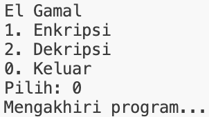

# Program El Gamal

## Identitas
- **Nama**: Rynad Arkansyah Gunawan  
- **NPM**: 140810230079  
- **Program**: El Gamal dengan C++

---

## Deskripsi
Program ini merupakan implementasi algoritma **El Gamal Cipher** berbasis C++.

Fitur yang tersedia:
1. **Enkripsi** plaintext huruf (A–Z) menjadi ciphertext pasangan `(C1, C2)`.  
2. **Dekripsi** ciphertext `(C1, C2)` menjadi plaintext huruf.  
3. Program secara otomatis menampilkan konversi huruf ke angka.

Program berjalan dalam mode menu interaktif sehingga pengguna dapat memilih operasi yang ingin dilakukan.

---

## Alur Program
1. **Menu Utama**  
   Saat dijalankan, program menampilkan menu:
   - `1` → Enkripsi
   - `2` → Dekripsi
   - `0` → Keluar dari program

2. **Enkripsi**
   - Masukkan bilangan prima `p`, generator `g`, kunci privat `x`, dan bilangan acak `k`.  
   - Program menghitung kunci publik `y = g^x mod p`.  
   - Masukkan plaintext berupa huruf.  
   - Program mengubah huruf → angka.  
   - Hasil enkripsi berupa ciphertext `(C1, C2)` untuk setiap huruf.

3. **Dekripsi**
   - Masukkan bilangan prima `p`, generator `g`, dan kunci privat `x`.  
   - Masukkan jumlah huruf dan pasangan ciphertext `(C1, C2)`.  
   - Program menghitung plaintext kembali dalam bentuk angka dan huruf.  
   - Hasil dekripsi ditampilkan sebagai plaintext huruf.

4. **Keluar**  
   - Pilih `0` untuk mengakhiri program.  
   - Program akan memberi pesan `Mengakhiri program...`.

---

## Cara Compile & Menjalankan Program
```bash
g++ elgamal.cpp -o elgamal
./elgamal
```

---
# Screenshoot Running Program

## Enkripsi


## Dekripsi


## Keluar Program
