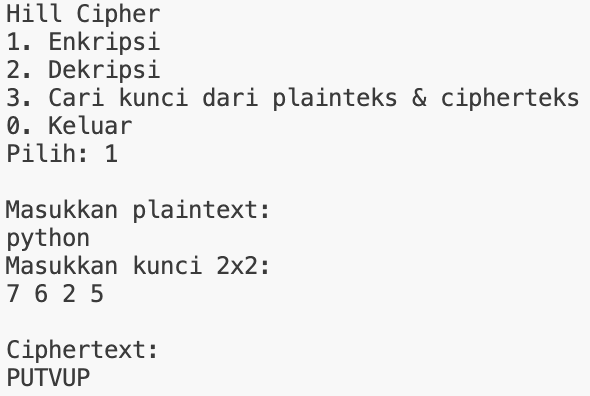

# Program Hill Cipher

## Identitas
- **Nama**: Rynad Arkansyah Gunawan  
- **NPM**: 140810230079  
- **Program**: Hill Cipher dengan C++

---

## Deskripsi
Program ini merupakan implementasi algoritma **Hill Cipher** berbasis C++.

Fitur yang tersedia:
1. **Enkripsi** plaintext menjadi ciphertext.
2. **Dekripsi** ciphertext menjadi plaintext.
3. **Mencari kunci** matriks 2x2 dari pasangan plaintext dan ciphertext.

Program berjalan dalam mode menu interaktif sehingga pengguna dapat memilih operasi yang ingin dilakukan.

---

## Alur Program
1. **Menu Utama**  
   Saat dijalankan, program menampilkan menu:
   - `1` → Enkripsi
   - `2` → Dekripsi
   - `3` → Cari kunci dari plainteks & cipherteks
   - `0` → Keluar dari program

2. **Enkripsi**
   - Masukkan plaintext (hanya huruf A–Z).  
   - Masukkan matriks kunci 2x2.  
   - Jika panjang plaintext ganjil, otomatis ditambahkan huruf `X`.  
   - Hasil enkripsi ditampilkan sebagai ciphertext.

3. **Dekripsi**
   - Masukkan ciphertext.  
   - Masukkan matriks kunci 2x2.  
   - Program akan menghitung matriks invers kunci untuk melakukan dekripsi.  
   - Jika determinan tidak memiliki invers mod 26, program akan memberi pesan `Determinan tidak memiliki invers modulo 26`.  
   - Hasil dekripsi ditampilkan sebagai plaintext.

4. **Mencari Kunci**
   - Masukkan **4 huruf plaintext** dan **4 huruf ciphertext**.  
   - Program akan menghitung matriks kunci menggunakan rumus:  
     ```
     K = C * P^-1 (mod 26)
     ```
   - Jika kunci bisa dihitung, hasil matriks ditampilkan.  
   - Jika tidak, muncul pesan `Kunci tidak dapat ditemukan!`.

5. **Keluar**  
   - Pilih `0` untuk mengakhiri program.
   - Program akan memberi pesan `Mengakhiri program...`.
---

## Cara Compile & Menjalankan Program
```bash
g++ hillcipher.cpp -o hillcipher
./hillcipher
```

---
# Screenshoot Running Program

## Enkripsi


## Dekripsi


## Mencari Kunci (ditemukan)


## Mencari kunci (tidak invers modulo 26)


## Keluar Program
