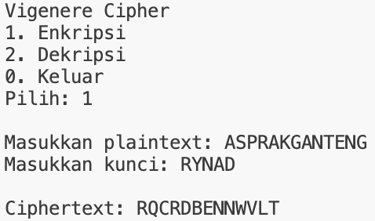

# Program Vigenere Cipher

## Identitas
- **Nama**: Rynad Arkansyah Gunawan  
- **NPM**: 140810230079  
- **Program**: Vigenere Cipher dengan C++

---

## Deskripsi
Program ini merupakan implementasi algoritma **Vigenere Cipher** berbasis C++.  

Fitur yang tersedia:
1. **Enkripsi** plaintext menjadi ciphertext.
2. **Dekripsi** ciphertext menjadi plaintext.

Program berjalan dalam mode menu interaktif sehingga pengguna dapat memilih operasi yang ingin dilakukan.

---

## Alur Program
1. **Menu Utama**  
   Saat dijalankan, program menampilkan menu:
   - `1` → Enkripsi
   - `2` → Dekripsi
   - `0` → Keluar dari program

2. **Enkripsi**
   - Masukkan plaintext (hanya huruf A–Z).  
   - Masukkan kunci (key).  
   - Program akan mengubah setiap huruf plaintext dengan penjumlahan huruf kunci secara berulang menggunakan operasi mod 26.  
   - Hasil enkripsi ditampilkan sebagai ciphertext.

3. **Dekripsi**
   - Masukkan ciphertext.  
   - Masukkan kunci (key).  
   - Program akan mengembalikan ciphertext ke plaintext dengan mengurangi huruf kunci secara berulang menggunakan operasi mod 26.  
   - Hasil dekripsi ditampilkan sebagai plaintext.

4. **Keluar**  
   - Pilih `0` untuk mengakhiri program.  
   - Program akan memberi pesan `Mengakhiri program...`.

---

## Cara Compile & Menjalankan Program
```bash
g++ vigenere.cpp -o vigenere
./vigenere

---
# Screenshoot Running Program

## Enkripsi


## Dekripsi


## Keluar Program
